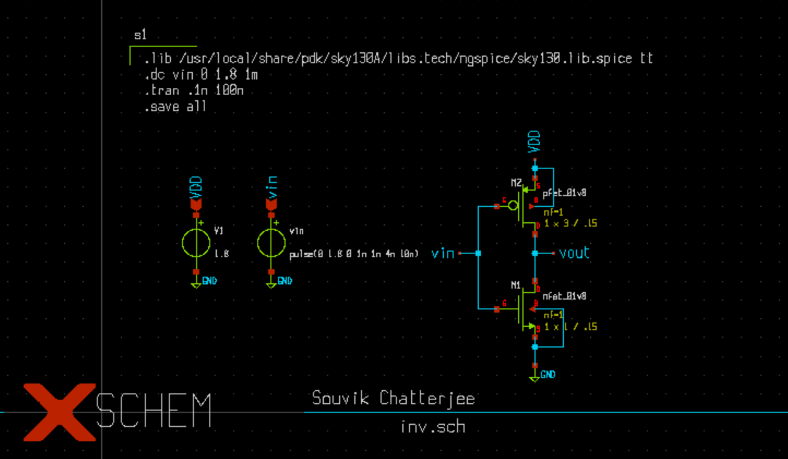

# cmos inverter design_sky130pdk_xscheme_ngspice
---
## Content
- [1. INTRODUCTION](#1-INTRODUCTION)
- [2. CMOS Inverter Design and Analysis](##1-Tools-and-PDK-setup)
  - [2.1 CMOS DC analysis](##11-Tools-and-PDK-setup)
  - [2.2 CMOS transient analysis](##12-Tools-and-PDK-setup)
---
## INTRODUCTION 

## CMOS Inverter design and Analysis

### CMOS DC Analysis
### CMOS Transient Analysis
